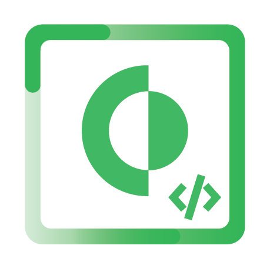

Cortex Xpanse Python SDK
========================

Overview
--------

This library is intended to be an interface to the `Cortex Xpanse Public API <https://docs-cortex.paloaltonetworks.com/r/Cortex-XPANSE/Cortex-Xpanse-API-Reference>`_.

Install
-------
.. code-block:: python

    pip install xpanse

Requirements
------------

``Python 3.7+``

Usage
-----

.. code-block:: python

    # Import client
    from xpanse.client import XpanseClient

    # Initialize client
    client = XpanseClient()

    # Get assets iterator object and dump to a list
    assets = client.assets.list().dump()

You can view more example code in the `examples <https://github.com/PaloAltoNetworks/cortex-xpanse-python-sdk/tree/main/examples>`_.

Configuration
-------------
A valid ``API Key``, ``API Key ID``, and ``Fully Qualified Domain Name (FQDN)`` are required for use.

Reference the docs for more information with `Getting Started <https://docs-cortex.paloaltonetworks.com/r/Cortex-XPANSE/Cortex-Xpanse-API-Reference/Get-Started-with-APIs>`_.

**RECOMMENDED**

You can supply them as environment variables.

.. code-block:: python

    export CORTEX_FQDN=<Your Xpanse Instance URL>
    export CORTEX_API_KEY=<API Key>
    export CORTEX_API_KEY_ID=<API Key ID>

**NOT RECOMMENDED**

The following parameters can be set inline using the ``XpanseClient`` constructor.

*This is not recommended, as it easily exposes sensitive credentials in your source code.*

.. code-block:: python

    # Import client
    from xpanse.client import XpanseClient

    # Initialize client - THIS IS NOT RECOMMENDED, SET ENVIRONMENT VARIABLES INSTEAD
    client = XpanseClient(url="https://my-company.crtx.us.paloaltonetworks.com",
                          api_key="xxxxxxxxxxxxxxxApiKeyxxxxxxxxxxxxxxx",
                          api_key_id=1)

Logging
-------
Logging is handled through the python logging package. To enable different levels of verbosity in your scripts you can do the following:

.. code-block:: python

    import logging

    # Set the logging level
    logging.basicConfig(level=logging.DEBUG)

You can read more at `<https://docs.python.org/3/library/logging.html>`_.